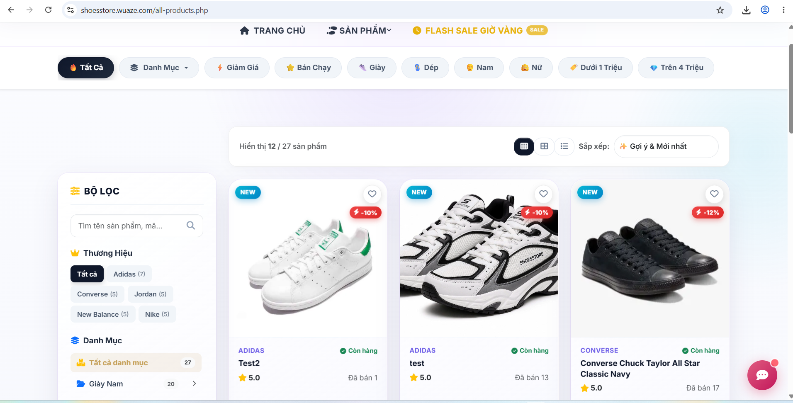
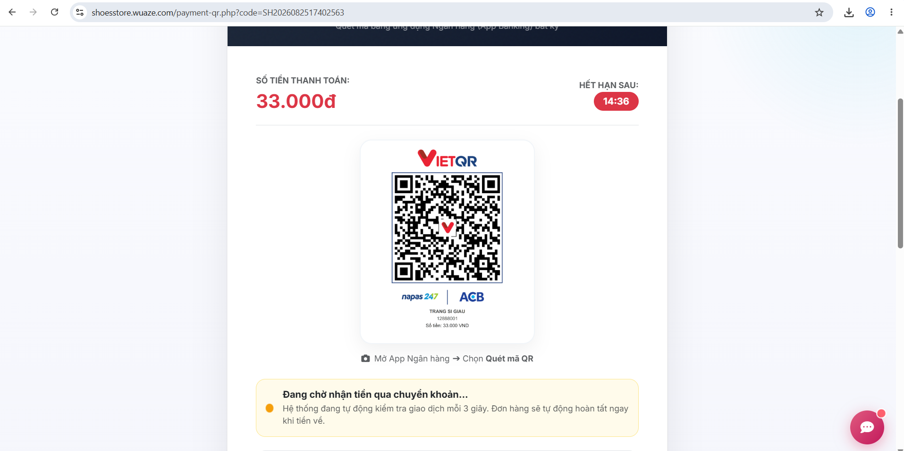
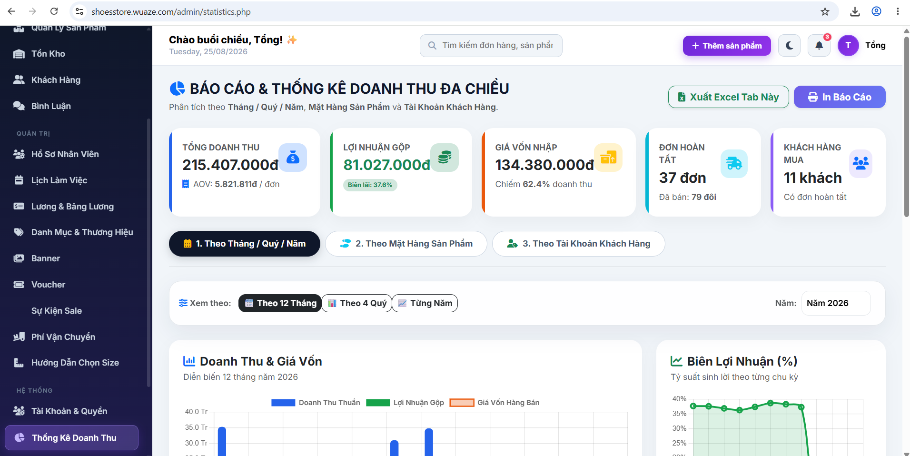

# 👟 SHOE STORE MANAGEMENT & E-COMMERCE SYSTEM

[](https://www.php.net/)
[](https://www.mysql.com/)
[](https://developer.mozilla.org/)
[](https://opensource.org/licenses/MIT)

> **Hệ thống thương mại điện tử và quản lý bán hàng giày dép cao cấp**, tích hợp thanh toán tự động VietQR, đăng nhập Google OAuth 2.0, trợ lý AI tư vấn và bảng điều khiển quản trị (Admin Dashboard) toàn diện.
> 
> 🌐 **Live Website Demo:** [http://shoesstore.wuaze.com](http://shoesstore.wuaze.com)

---

## 🌟 Tính Năng Nổi Bật (Key Features)

### 🛒 Khách hàng & Giao diện người dùng (Customer Experience)
* **Giao diện hiện đại (Modern & Responsive UI):** Thiết kế chuẩn Mobile-first, Dark/Light Mode, tối ưu trải nghiệm người dùng với micro-animations.
* **Bộ lọc & Tìm kiếm thông minh (Live Search & Smart Filtering):** Tìm kiếm tức thì qua AJAX, lọc theo danh mục, thương hiệu, size, màu sắc và tầm giá.
* **Chi tiết sản phẩm & Chọn biến thể (Variant & Size Guide):** Quản lý tồn kho theo biến thể (Size/Màu), tích hợp bảng tính size giày thông minh.
* **Giỏ hàng & Khuyến mãi (Cart & Voucher Engine):** Áp dụng mã giảm giá theo điều kiện (giảm %, giảm tiền mặt, miễn phí vận chuyển).
* **Tính phí vận chuyển tự động:** Tích hợp tính phí giao hàng linh hoạt theo 63 tỉnh/thành phố Việt Nam.
* **Cổng thanh toán đa dạng:**
  * Thanh toán khi nhận hàng (COD).
  * Chuyển khoản ngân hàng tự động với mã **VietQR** động (tự nhận diện số tiền và mã đơn hàng).
* **Đăng nhập linh hoạt:** Đăng nhập truyền thống, xác thực mã OTP qua Email, và Đăng nhập nhanh bằng **Google OAuth 2.0**.
* **Trợ lý ảo AI (Gemini AI Shopping Assistant):** Chatbot AI thông minh tư vấn chọn giày dép và hỗ trợ khách hàng 24/7.
* **Theo dõi đơn hàng & Đánh giá:** Timeline trạng thái đơn hàng trực quan và hệ thống bình luận/đánh giá sản phẩm.

---

### 💼 Hệ thống Quản trị viên (Admin Dashboard)
* **Tổng quan kinh doanh (Analytics & Reports):** Biểu đồ doanh thu, thống kê lợi nhuận, số lượng đơn hàng và top sản phẩm bán chạy.
* **Quản lý sản phẩm & Kho hàng (Inventory Management):** Quản lý biến thể, cảnh báo hết hàng, cơ chế khóa hàng (row-locking transaction) tránh quá bán.
* **Xử lý đơn hàng & In ấn:** Quản lý vòng đời đơn hàng, xuất hóa đơn và in phiếu giao hàng (Shipping Label).
* **Quản lý nhân sự & Bảng lương (HR & Payroll):** Phân ca làm việc, chấm công và tự động tính lương nhân viên kèm phiếu lương in ấn.
* **Marketing & Sự kiện:** Quản lý chiến dịch Flash Sale, Banners sự kiện, và hệ thống Voucher giảm giá.

---

## 📸 Hình Ảnh Giao Diện Demo (Screenshots)

| 🏠 Trang Chủ & Banner (Homepage) | 👟 Chi Tiết Sản Phẩm & Tư Vấn AI (Product Detail) |
| :---: | :---: |
|  |  |

| 💳 Thanh Toán Tự Động VietQR | 📊 Bảng Điều Khiển Quản Trị (Admin Dashboard) |
| :---: | :---: |
|  |  |

---

## 🛠️ Công Nghệ Sử Dụng (Tech Stack)

* **Backend:** PHP 8.1+ (OOP, MVC-style Architecture, Prepared Statements, Secure Transactions)
* **Database:** MySQL / MariaDB (Optimized Indexes, Foreign Keys, Stored Procedures)
* **Frontend:** Vanilla HTML5, CSS3 (Modern Glassmorphism, CSS Variables), JavaScript ES6+ (AJAX, Fetch API)
* **Tích hợp bên thứ ba (APIs & Integrations):**
  * **Google Identity Services:** Google OAuth 2.0 SSO
  * **VietQR API:** Tạo mã QR thanh toán ngân hàng tự động
  * **Google Gemini AI API:** Mô hình AI tư vấn khách hàng
  * **PHPMailer:** Gửi email xác thực OTP và thông báo đơn hàng

---

## 🚀 Hướng Dẫn Cài Đặt & Chạy Thử (Installation)

### 1. Yêu cầu môi trường
* **XAMPP / WampServer** (PHP >= 8.1, Apache, MySQL)
* Các PHP Extensions kích hoạt: `mysqli`, `curl`, `mbstring`, `openssl`

### 2. Cài đặt CSDL (Database)
1. Mở **phpMyAdmin** tại `http://localhost/phpmyadmin/`.
2. Tạo một cơ sở dữ liệu mới có tên: `web_shoe`.
3. Chọn cơ sở dữ liệu `web_shoe` và bấm **Import**, chọn file `database/database.sql` trong thư mục dự án.

### 3. Cấu hình hệ thống
1. Đặt thư mục dự án vào `C:/xampp/htdocs/shoe-store-system` (hoặc tên tương ứng).
2. Kiểm tra thông tin kết nối Database trong file `config/db.php`:
   ```php
   define('DB_HOST', 'localhost');
   define('DB_USER', 'root');
   define('DB_PASS', '');
   define('DB_NAME', 'web_shoe');
   ```

### 4. Khởi chạy
* Truy cập trang chủ khách hàng: `http://localhost/web-shoe/` (hoặc tên thư mục tương ứng).
* Truy cập trang quản trị Admin: `http://localhost/web-shoe/admin/`
  * **Tài khoản Admin mặc định:** `admin` / `password` (hoặc xem danh sách trong CSDL).

---

## 📂 Cấu Trúc Thư Mục (Project Structure)

```text
├── admin/                 # Giao diện & chức năng quản trị viên
├── api/                   # RESTful API endpoints (AI Chat, Live Search, Thanh toán...)
├── assets/                # CSS, JS, Fonts và Icons
├── config/                # Cấu hình Database và dịch vụ thứ 3
├── database/              # Database SQL Schema và dữ liệu mẫu
├── docs/                  # Tài liệu & hình ảnh chụp màn hình demo (Screenshots)
├── includes/              # Component dùng chung (Header, Footer, Helpers...)
├── uploads/               # Thư mục lưu trữ hình ảnh sản phẩm, banner, avatar
├── index.php              # Trang chủ website
├── cart.php               # Giỏ hàng
├── checkout.php           # Thanh toán
└── README.md              # Tài liệu giới thiệu dự án
```

---

## 👨‍💻 Tác giả (Author)
* **Họ và tên:** Trang Sĩ Giàu
* **GitHub:** [@Giau66](https://github.com/Giau66)
* **Website Demo:** [http://shoesstore.wuaze.com](http://shoesstore.wuaze.com)
* **Project Repository:** [shoe-store-system](https://github.com/Giau66/shoe-store-system)
